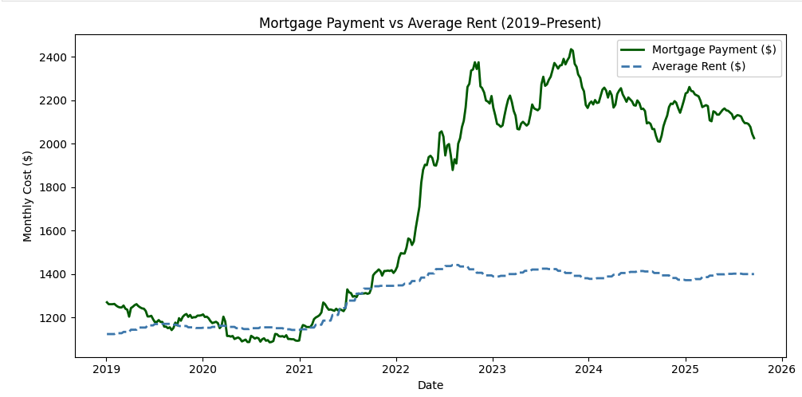
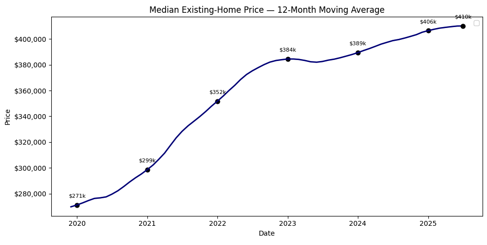
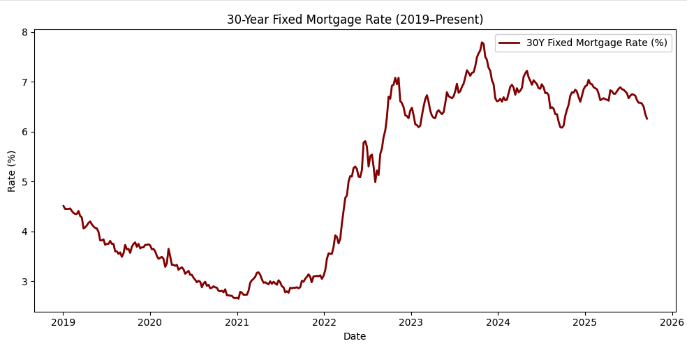

# U.S. Home Ownership Affordability Crisis

This project analyzes the **affordability crisis in U.S. home ownership** by exploring trends in 
mortgage rates, home prices, and household incomes.

## 📈 Key Highlights
- Integrated mortgage rates (FRED), median home prices (NAR), and household income data (Census).
- Built affordability metrics such as **price-to-income ratios** and **mortgage payment-to-income ratios**.
- Visualized trends to show how unaffordable home buying has become over the last few years.
- Provided market insights on drivers of housing unaffordability.

## 🛠️ Tech Stack
Python · pandas · numpy · matplotlib/plotly

## 🚀 How to Run
1. Clone this repository
2. Run the Python Notebook
   
## 📊 Results

Below are example visuals from the project:

### Cost of Buying vs Renting

### Price Increases

### Rate Increases

